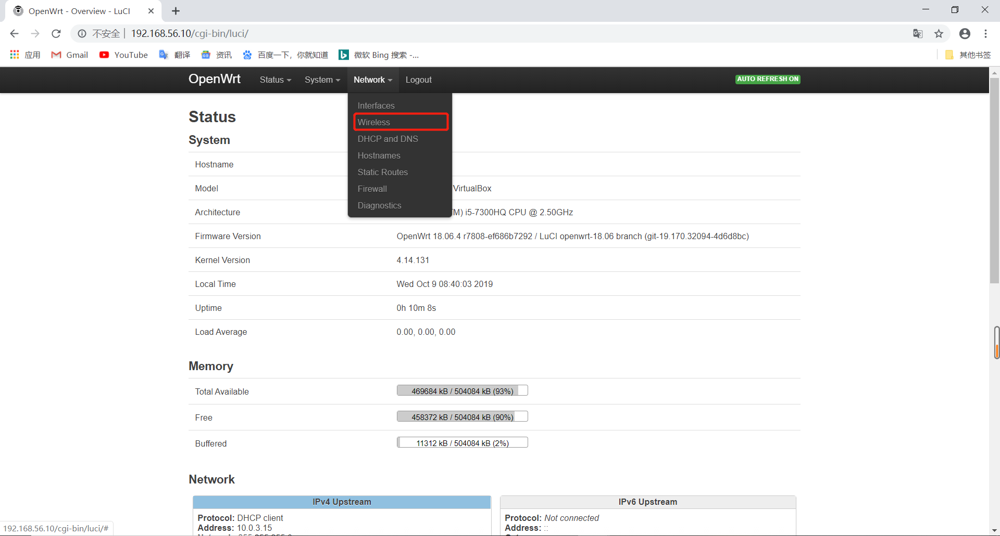

# OpenWrt On Virtualbox
## 实验完成度
  * [x] 完成Openwrt.vdi的基本配置
  * [x] 能够通过LuCi 这个网页形式的管理界面
  * [x] 网卡驱动安装成功
  * [x] LuCi 这个网页能够显示wireless
  * [ ] 能够扫描到wireless


## 实验步骤
* 下载并安装OpenWrt(稳定版)
  1. [OpenWrt](https://downloads.openwrt.org/)->Snapshot download->x86->64/->combined-squashfs.img.gz  
  2. 找到VBoxManage.exe所在的位置，将此路径添加环境变量  
  3. 进入到OpenWrt所在位置
  4. 将.img转化为vdi文件
  ```
  >>VBoxManage convertfromraw --format VDI openwrt-x86-64-combined-squashfs.img openwrt-x86-64-combined-squashfs.vdi
  ```
  
  5. 扩展vdi的内存
  ```
  windows: >>VBoxManage modifyhd openwrt-x86-64-combined-squashfs.vdi --resize 512
  ```
* 新建OpenWrt虚拟机
  1. 利用openwrt-x86-64-combined-squashfs.vdi.新建一个Kali的虚拟机
  2. 修改网络配置：    
  第一块网卡设置为：Intel PRO/1000 MT 桌面（仅主机(Host-Only)网络）    
  第二块网卡设置为：Intel PRO/1000 MT 桌面（网络地址转换(NAT)）   
  
  host-only网络设置如下图所致
  
  
  3. 进入网络配置文件   
  ```vi /etc/config/network```
  按'i'进行修改
     
  并删去'wan6'的一段配置
  按下Esc键，:x保存并退出
  4. 重启系统   
  ```reboot```
  5. 安装luci
  ```
  opkg update   
  opkg install luci
  ```
  

* Luci浏览器访问管理OpenWrt
  1. 网页输入192.168.56.10，直接login
  
  2. 设置密码，与root对应的密码
  3. 进入SSH Access设置，将interface设置为lan 
  
  4. 将github（user下面的./ssh/id_rsa.pub）当时生成的ssh-keys写入配置

* 开启AP功能
  1. 此时菜单没有无线的配置入口
  
  2. 关闭虚拟机，将USB设备改为3.0的设备
  
  3. ```opkg update && opkg install usbutils```
  
  4. 查网卡，查看网卡是否成功,安装驱动见实验问题     

* 验证wireless
  1. 重新安装一个虚拟机后，出现了wireless
  
  2. scan一下，发现周边网络
    
  3. 点击edit，将Transmit Power改为 10dBm->MOde:N改为Legacy->network lan改为wan；
  4. 安装WPA-PSK
  ```opkg install wpa-supplicant hostapd ```     
  应用后重新进入编辑->wireless security
      
  
## 实验结论
  * 最后的结果应该是可以扫描到LZQOpenWrt的Wifi，其本质就是virtualbox中的OpenWrt借助无线网卡硬件设备开启无线网络，提供无线网卡的虚拟化仿真功能。
  * luci是一种脚本语言，是基于MVC架构的，M是已经生成的web控件（lua脚本），V是视图，对外部提供的一些web界面，C控制M和V的显示方式。就和Apache的功能差不多
  
## 实验问题
  * 发现usb有显示，但是lsusb查看没有找到网卡
    
    1. 登录另一个虚拟机查看无线网卡,发现网卡有显示,说明无线网卡和虚拟机没有问题，是LZQ-Kali-OpenWrt这台虚拟机出问题
    
    2. 启用USB的过滤器
    
    3. 再次重启发现有了显示  
    
  * 无线网卡没有对应的驱动器
       
    1. opkg find 命令可以快速查找可能包含指定芯片名称的驱动程序包
    ``` opkg find kmod-* | grep  9271 ```   
    发现没有对应包 ，```opkg update```一下就可   
    2. 查资料发现Openwrt的最低版本是18.06.0
    
    3. ```opkg install kmod-ath9k-htc ```    
    下载失败
       
    内核太低，重新下一个18.06.4的版本
    4. img->vdi时候出错，参考第二个资料。（dd命令可在虚拟机中执行）
    5. 上不了网，对比把wan的配置添上
    6. 重新安装18.06.4后成功
    
    

## 参考文献
   * [kmod-ath9k- openwrt](https://openwrt.org/packages/pkgdata_lede17_1/kmod-ath9k-htc)
   * [新版openwrt装到虚拟机上](https://openwrt.org/docs/guide-user/virtualization/virtualbox-vm)
