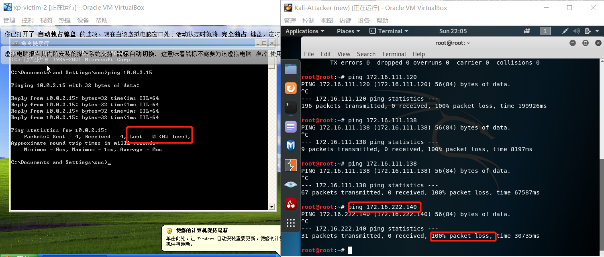
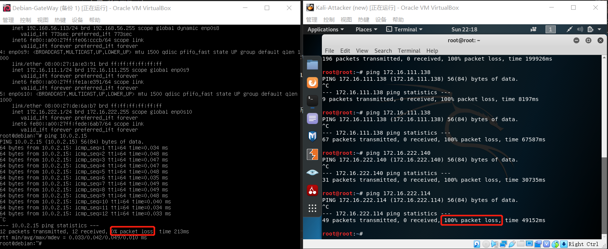
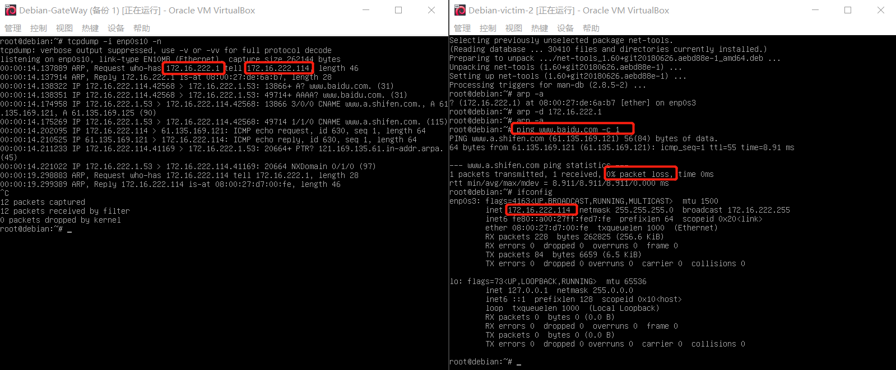

# 基于 VirtualBox 的网络攻防基础环境搭建
## 实验完成度
* 实验环境配置
  * [x] 虚拟硬盘的多重加载
  * [x] 搭建好符合要求的虚拟机网络拓扑
* 完成以下网络连通性测试；
  * [x] 不同内网的靶机无法相互访问
  * [x] 靶机可以直接访问攻击者主机
  * [x] 攻击者主机无法直接访问靶机
  * [x] 网关可以直接访问攻击者主机和靶机
  * [x] 靶机的所有对外上下行流量必须经过网关
  * [x] 所有节点均可以访问互联网

## 实验步骤
### **虚拟硬盘的多重加载**
   1. 新建一个虚拟机 Kali-Attacker
   2. 管理->虚拟介质管理器->将Kali-Attacker.vdi的属性由普通改为多重加载->点击释放
   3. 选择Kali-Attacker的设置->存储->使用现有虚拟硬盘->选择Kali-Attacker.vdi
   4. xp和Debian系统使用老师所提供的vdi,首先在使用现有硬盘之前进行注册后，再重复第二步与第三步，进行多重加载。
   5. 如图1所示，六台机器都使用了多重加载（图片只显示其中三台，就是实验所用到的三种系统）
   图1
### **构建符合要求的虚拟机网络拓扑**    
    修改每台虚拟机的网络设置：设置->网络->网络连接方式
   1. 攻击者：Kali-Attacker的网络设置如图2所示
   图2
   2. 网关：Debian-Gateway的网络设置如图3所示
   图3
   3. 靶机1：xp-victim-1和Kali-victim-1的网络设置如图4所示
   
   
   图4
   4. 靶机2：xp-victim-2和Debian-victim-2的网络设置如图5所示
   
   
   图5
### **完成网络连通性测试**

  ```ipconfig /all```得到所有相关配置
  如图6所示可得下表
  
  ```ifconfig```
  
  ```ip address show```
    

  | 地址 | xp-victim-1 | Kali-victim-1|xp-victim-2 | Debian-victim-2|Kali-Attacker|Debian-Gateway|
  |:-----|----|----|----|----|----|----|
  | ip | 172.16.111.138 | 172.16.111.120|172.16.222.140 | 172.16.222.114| 10.0.2.15/192.168.56.103|10.0.2.15/192.168.56.113/172.16.111.1/172.16.222.1| 
  
* **不同内网的靶机无法相互访问**
    1. 关闭 xp-victim-2的防火墙
    2. ```ping 172.16.222.140``` 发现无法连接，请求超时，如图7所示
      
    图7

*  **靶机可以直接访问攻击者主机&攻击者主机无法直接访问靶机**
    1. Kali-victim-1: ```ping 10.0.2.15```,ping得通
      Kali-Attacker：```ping 172.16.111.120```,ping不通
       
    2. xp-victim-1: ```ping 10.0.2.15```,ping得通
      Kali-Attacker：```ping 172.16.111.138```,ping不通
       
    3. xp-victim-2: ```ping 10.0.2.15```,ping得通
      Kali-Attacker：```ping 172.16.222.140```,ping不通
       
    4. Debian-victim-2: ```ping 10.0.2.15```,ping得通
      Kali-Attacker：```ping 172.16.222.114```,ping不通
       

* **网关可以直接访问攻击者主机和靶机**
    1. 分别访问Debian-victim-2,xp-victim-1,xp-victim-2,Kali-victim-1,Kali-Attacker
    ``` 
    ping  172.16.222.114 -c 3
    ping  172.16.111.138 -c 2
    ping  172.16.222.140 -c 2
    ping  172.16.111.120 -c 2
    ping  10.0.2.15 -c 2
    ```
    
    

* **靶机的所有对外上下行流量必须经过网关**
    查看网关的所有网卡
    
    1. 首先清除xp-victim-1的arp；
    ```arp -a```查看arp缓存
    ```arp -d 172.16.111.1```删除网关缓存
    
    2. Debian-Gateway先开始进行抓包,使用intnet1,enp0s9
    ```tcpdump -i enp0s9 -n ```
    此时很干净，没有包
    3. xp-victim-1开始访问百度
    ```ping www.baidu.com -n 1```
    
    由图可以验证靶机的所有对外上下行流量必须经过网关（原因分析写在下面的实验结论中）

    4. 同理对xp-victim-2进行验证，使用intnet2,enp0s10
    
    5. 同理对Kali-victim-1进行验证，使用intnet1,enp0s9
    ```ping www.baidu.com -c 1```
    
    6. 同理对Debian-victim-2进行验证，使用intnet2,enp0s10
    ```ping www.baidu.com -c 1```
    

* **所有节点均可以访问互联网**
    1. xp-victim-1: ```ping baidu.com```,如图所示可知，xp-victim-1可以访问外网
    
    2. 由于避免因为网络层之上,像应用层出现的错误导致不能访问的情况，如DNS服务出错，采用直接ping 百度的IP地址（由上图可得）
    3. xp-victim-1: ```ping 220.181.38.148```，可以访问互联网
    
    4. xp-victim-2：```ping 220.181.38.148```，可以访问互联网
    
    5. Debian-Gateway: ```ping 220.181.38.148```，可以访问互联网,ctrl+C停止
    
    6. Debian-victim-2: ```ping 220.181.38.148```，可以访问互联网
    
    7. Kali-Attacker:```ping 220.181.38.148```,可以访问互联网
    
    8. Kali-Attacker:```ping 220.181.38.148```,可以访问互联网
    


## 实验结论
  通过设定五台虚拟机的网络设置来达到如图所示的网络拓扑结构
  

  | 地址 | xp-victim-1 | Kali-victim-1|xp-victim-2 | Debian-victim-2|Kali-Attacker|Debian-Gateway|
  |:-----|----|----|----|----|----|----|
  | ip | 172.16.111.138 | 172.16.111.120|172.16.222.140 | 172.16.222.114| 10.0.2.15/192.168.56.103|10.0.2.15/192.168.56.113/172.16.111.1/172.16.222.1|  

  表1
  * **靶机可以直接访问攻击者主机&攻击者主机无法直接访问靶机**  
  
    通过表一可知所有的五台机器的IP地址所显示其实都是内网的IP地址，是上不了网的。  
    >局域网可以使用的网段:  
    >10.0.0.0-10.255.255.255（A类)  
    >172.16.0.0-172.31.255.255（B类）  
    >192.168.0.0-192.168.255.255（C类）  

    靶机之所以可以直接访问攻击者主机是因为攻击者的网络设置是NAT，它可以将自己的内网的IP地址转化成公网的IP地址即一个实际存在的IP地址，所以靶机可以直接访问到攻击者。同时，攻击者Ping靶机的IP地址是172.16.xx.xx,全球有许多台电脑的IP地址是与靶机的IP地址相同，四台八级都只设置了内网，并没有NAT的设置，所以他们并没有公网的IP地址。

  * **不同内网的靶机无法相互访问**
    主要原因是两种靶机分别连接在网关的两张不同的网卡上形成两个网卡，而同一网卡只能访问同一网段的机器。如表1所示intnet1的机器都是172.16.111.xx,intnet2的机器都是172.16.222.xx，所以不同内网的靶机无法相互访问。

  * **网关可以直接访问攻击者主机和靶机**
    1. 网关与xp-victim-1和Kali-victim-1都处在intnet1的网络中，所以他们可以相互通信;
    2. 网关与xp-victim-2和Debian-victim-2都处在intnet2的网络中，所以他们可以相互通信;
    3. 网关与Kali-Attacker都有NAT的网卡，这就相当于他们可以以主机为桥梁进行通信。

  * **为什么可以证明靶机的所有对外上下行流量必须经过网关**
    
    一台机器访问外网的几个步骤：
      1. 通过查看自己的相关的IP配置，找到自己的网关IP，通过广播ARP，询问网关的MAC地址
      2. 网关会回应主机一个arp包，中间包括自己的MAC地址
      3. 主机访问DNS本地服务器，提供网址
      4. DNS本地服务器提供对应的IP地址给主机
      5. 主机与百度服务器发送request
      6. 百度服务器发送一个reply
      7. 因为此时的IP包中间所填的目的IP地址是内网IP地址，而且提前清空了所有arp缓存表，所以网关同样需要通过ARP广播来找到主机。
      8. 主机回一个包含自己MAC地址的ARP包

      从上图可以看出，网关所抓取的包含了以上的所有的过程，所以可以证明靶机的所有对外上下行流量必须经过网关
    
## 实验问题
  * 安装的Kali-attacker上不了网
    Kali-Attacker:```ping 220.181.38.148```,ping不通
    
    1. 按照网站上的代码就可以
    ```
    grep "iface eth1 inet dhcp" /etc/network/interfaces || cat <<      EOF >> /etc/network/interfaces
    auto eth0
    iface eth0 inet dhcp
    auto eth1
    iface eth1 inet dhcp
    EOF
    
    systemctl restart networking

    ip a
    ```
  * 安装的Kali-attacker上不了网
    
    因为内存不太够，所以把Debian-Gateway关掉了，重启网关后就可以了

  * Debian没有arp,ifconfig等命令
    输入```apt install net-tools```
    
  

## 参考文献
* [debian 命令找不到](https://blog.csdn.net/sinat_33384251/article/details/93495397)
* [理解虚拟机中的四种网络连接方式](https://www.virtualbox.org/manual/UserManual.html#natforward)
