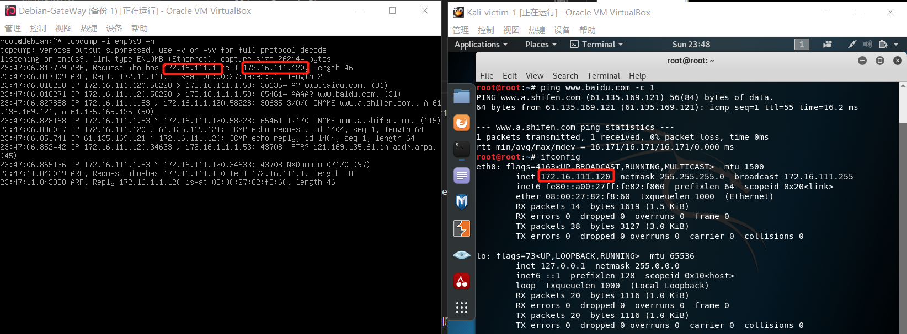

# 基于 VirtualBox 的网络攻防基础环境搭建
## 实验完成度
* 实验环境配置
  * [x] 虚拟硬盘的多重加载
  * [x] 搭建好符合要求的虚拟机网络拓扑
* 完成以下网络连通性测试；
  * [x] 不同内网的靶机无法相互访问
  * [x] 靶机可以直接访问攻击者主机
  * [x] 攻击者主机无法直接访问靶机
  * [x] 网关可以直接访问攻击者主机和靶机
  * [x] 靶机的所有对外上下行流量必须经过网关
  * [x] 所有节点均可以访问互联网

## 实验步骤
### **虚拟硬盘的多重加载**
   1. 新建一个虚拟机 Kali-Attacker
   2. 管理->虚拟介质管理器->将Kali-Attacker.vdi的属性由普通改为多重加载->点击释放
   3. 选择Kali-Attacker的设置->存储->使用现有虚拟硬盘->选择Kali-Attacker.vdi
   4. xp和Debian系统使用老师所提供的vdi,首先在使用现有硬盘之前进行注册后，再重复第二步与第三步，进行多重加载。
   5. 如图1所示，六台机器都使用了多重加载（图片只显示其中三台，就是实验所用到的三种系统）
   图1
### **构建符合要求的虚拟机网络拓扑**    
    修改每台虚拟机的网络设置：设置->网络->网络连接方式
   1. 攻击者：Kali-Attacker的网络设置如图2所示
   图2
   2. 网关：Debian-Gateway的网络设置如图3所示
   图3
   3. 靶机1：xp-victim-1和Kali-victim-1的网络设置如图4所示
   
   
   图4
   4. 靶机2：xp-victim-2和Debian-victim-2的网络设置如图5所示
   
   
   图5
### **完成网络连通性测试**

  ```ipconfig /all```得到所有相关配置
  如图6所示可得下表
  
  ```ifconfig```
  
  ```ip address show```
    

  | 地址 | xp-victim-1 | Kali-victim-1|xp-victim-2 | Debian-victim-2|Kali-Attacker|Debian-Gateway|
  |:-----|----|----|----|----|----|----|
  | ip | 172.16.111.138 | 172.16.111.120|172.16.222.140 | 172.16.222.114| 10.0.2.15/192.168.56.103|10.0.2.15/192.168.56.113/172.16.111.1/172.16.222.1| 
  
* **不同内网的靶机无法相互访问**
    1. 关闭 xp-victim-2的防火墙
    2. ```ping 172.16.222.140``` 发现无法连接，请求超时，如图7所示
      
    图7

*  **靶机可以直接访问攻击者主机&攻击者主机无法直接访问靶机**
    1. Kali-victim-1: ```ping 10.0.2.15```,ping得通
      Kali-Attacker：```ping 172.16.111.120```,ping不通
       
    2. xp-victim-1: ```ping 10.0.2.15```,ping得通
      Kali-Attacker：```ping 172.16.111.138```,ping不通
       
    3. xp-victim-2: ```ping 10.0.2.15```,ping得通
      Kali-Attacker：```ping 172.16.222.140```,ping不通
       
    4. Debian-victim-2: ```ping 10.0.2.15```,ping得通
      Kali-Attacker：```ping 172.16.222.114```,ping不通
       

* **网关可以直接访问攻击者主机和靶机**
    1. 分别访问Debian-victim-2,xp-victim-1,xp-victim-2,Kali-victim-1,Kali-Attacker
    ``` 
    ping  172.16.222.114 -c 3
    ping  172.16.111.138 -c 2
    ping  172.16.222.140 -c 2
    ping  172.16.111.120 -c 2
    ping  10.0.2.15 -c 2
    ```
    
    

* **靶机的所有对外上下行流量必须经过网关**
    查看网关的所有网卡
    
    1. 首先清除xp-victim-1的arp；
    ```arp -a```查看arp缓存
    ```arp -d 172.16.111.1```删除网关缓存
    
    2. Debian-Gateway先开始进行抓包,使用intnet1,enp0s9
    ```tcpdump -i enp0s9 -n ```
    此时很干净，没有包
    3. xp-victim-1开始访问百度
    ```ping www.baidu.com -n 1```
    
    由图可以验证靶机的所有对外上下行流量必须经过网关（原因分析写在下面的实验结论中）

    4. 同理对xp-victim-2进行验证，使用intnet2,enp0s10
    
    5. 同理对Kali-victim-1进行验证，使用intnet1,enp0s9
    ```ping www.baidu.com -c 1```
    
    6. 同理对Debian-victim-2进行验证，使用intnet2,enp0s10
    ```ping www.baidu.com -c 1```
    

* **所有节点均可以访问互联网**
    1. xp-victim-1: ```ping baidu.com```,如图所示可知，xp-victim-1可以访问外网
    
    2. 由于避免因为网络层之上,像应用层出现的错误导致不能访问的情况，如DNS服务出错，采用直接ping 百度的IP地址（由上图可得）
    3. xp-victim-1: ```ping 220.181.38.148```，可以访问互联网
    
    4. xp-victim-2：```ping 220.181.38.148```，可以访问互联网
    
    5. Debian-Gateway: ```ping 220.181.38.148```，可以访问互联网,ctrl+C停止
    
    6. Debian-victim-2: ```ping 220.181.38.148```，可以访问互联网
    
    7. Kali-Attacker:```ping 220.181.38.148```,可以访问互联网
    
    8. Kali-Attacker:```ping 220.181.38.148```,可以访问互联网
    


## 实验结论
  通过设定五台虚拟机的网络设置来达到如图所示的网络拓扑结构
  

  | 地址 | xp-victim-1 | Kali-victim-1|xp-victim-2 | Debian-victim-2|Kali-Attacker|Debian-Gateway|
  |:-----|----|----|----|----|----|----|
  | ip | 172.16.111.138 | 172.16.111.120|172.16.222.140 | 172.16.222.114| 10.0.2.15/192.168.56.103|10.0.2.15/192.168.56.113/172.16.111.1/172.16.222.1|  

  表1
  ## 重新修改内容 
  
  * 靶机可以直接访问攻击者主机&攻击者主机无法直接访问靶机&网关可以直接访问攻击者主机和靶机
  
    * 虚拟机中的NatNetWork网卡是一块普通的网卡，而nat服务的提供是由网关提供。对于Debian-GateWay和Kali-Attacker来说，他们的nat服务是由客机提供。而对于所有的靶机来说，老师所提供的Debian-GateWay的配置中有配置nat服务。  
    查看网关的配置，有设置nat服务，```sudo vi /etc/network/interfaces```,```iptables-save```      
    
    
    

    
    * ping通这个过程包含了两个包：ICMP Echo Request和ICMP Echo Reply，经历四个过程：源主机向目标主机发送request后，目标主机收到request包，目标主机发送一个对应的reply包，源主机接收到对应的reply包，这四个过程中任意一个过程出现了错误都会被显示为ping不通。

    * 宿主机提供的Nat服务只在虚拟机访问互联网时生效。当不涉及到互联网时，Debian-GateWay和Kali-Attacker的两块网卡就是处于同一子网下的普通网卡，这两台机器处于同一子网，所以Debian-GateWay和Kali-Attacker理所当然是可以相互访问的。同理，Debian-GateWay和所有的靶机也是处于同一片子网（intnet1和intnet2）中，所以网关和所有靶机也是可以相互访问的。   
    
    * Nat的作用是将内网的IP映射为本机外网IP+端口，靶机所发送的request包在经过网关后，经过nat服务，request包的源IP地址被改为网关自己的外网所对应的IP地址+端口号，然后被发送给攻击者，所以在攻击者看来是网关在与自己通信。而攻击者发送的reply的包在到达网关时，网关会根据对应的端口再把这个包传给靶机。所以在靶机看来就是“靶机能ping通攻击者”。   

    * 攻击者ping不通靶机是因为他的request包是无法根据目标的IP地址到达靶机的。


  * **为什么可以证明靶机的所有对外上下行流量必须经过网关**
    
    一台机器访问外网的几个步骤：
      1. 通过查看自己的相关的IP配置，找到自己的网关IP，通过广播ARP，询问网关的MAC地址
      2. 网关会回应主机一个arp包，中间包括自己的MAC地址
      3. 主机访问DNS本地服务器，提供网址
      4. DNS本地服务器提供对应的IP地址给主机
      5. 主机与百度服务器发送request
      6. 百度服务器发送一个reply
      7. 因为此时的IP包中间所填的目的IP地址是内网IP地址，而且提前清空了所有arp缓存表，所以网关同样需要通过ARP广播来找到主机。
      8. 主机回一个包含自己MAC地址的ARP包

      从上图可以看出，网关所抓取的包含了以上的所有的过程，所以可以证明靶机的所有对外上下行流量必须经过网关   
      

## 实验问题
  * 安装的Kali-attacker上不了网
    Kali-Attacker:```ping 220.181.38.148```,ping不通
    
    1. 按照网站上的代码就可以
    ```
    grep "iface eth1 inet dhcp" /etc/network/interfaces || cat <<      EOF >> /etc/network/interfaces
    auto eth0
    iface eth0 inet dhcp
    auto eth1
    iface eth1 inet dhcp
    EOF
    
    systemctl restart networking

    ip a
    ```
  * 安装的Kali-attacker上不了网
    
    因为内存不太够，所以把Debian-Gateway关掉了，重启网关后就可以了

  * Debian没有arp,ifconfig等命令
    输入```apt install net-tools```
    
  

## 参考文献
* [debian 命令找不到](https://blog.csdn.net/sinat_33384251/article/details/93495397)
* [nat （网络地址转换方法）](https://baike.baidu.com/item/nat/320024)
* [理解虚拟机中的四种网络连接方式](https://blog.csdn.net/ning521513/article/details/78441392)
