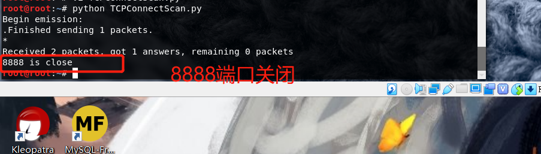
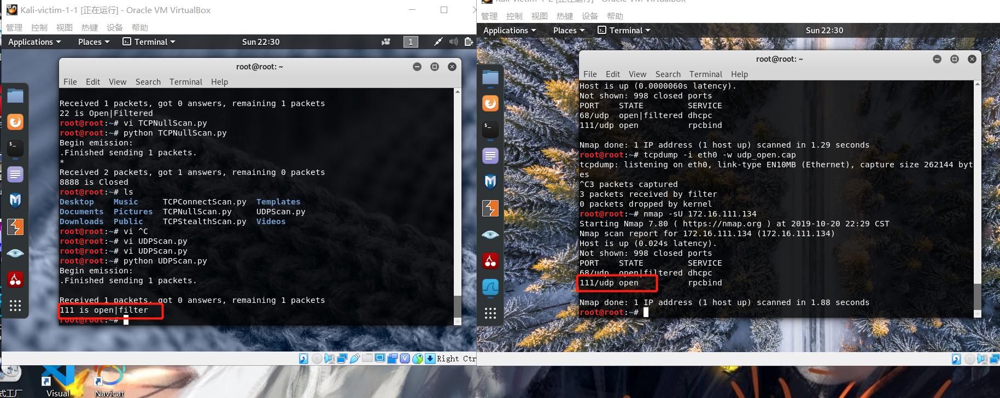

# 基于 Scapy 编写端口扫描器
## 实验目的
  * 掌握网络扫描之端口状态探测的基本原理
## 实验环境
  * python + scapy
  * 虚拟环境(两台kali,一台Debian网关)
## 实验完成度
  * [x] 搭建自己的网络环境       
  * [x] 编程实现TCP connect scan / TCP stealth scan扫描技术     
  * [x] 编程实现TCP Xmas scan / TCP fin scan / TCP null scan扫描技术
  * [x] 编程实现UDP scan扫描技术   
  * [x] 分析每次扫描的抓包结果
  
## 实验步骤
  * 搭建好网络环境  
    1. 网络设置   
      
    2. 进行网络连通性检验   

    |  | kail-victim-1-1 | kail-victim-1-2  |Debian-GteWay |
    | :-----| :---- | :---- |:---- |
    | IP地址 | 172.16.111.120 | 172.16.111.134 |172.16.111.1|   
    kali能够访问网关，互联网和相互访问   
          
    网关可以访问两台kali   
        

  * 编程实现TCP connect scan扫描技术
    1. 扫描原理   
       
    2. 根据发送TCP包后的回复包来判断端口的状态   
    基础代码如下
    ```python
    from scapy.all import *

    dst_ip = "172.16.111.134"
    src_ip = "172.16.111.120"
    dst_port=8888

    TCPConnectScanResponse = sr1(IP(src=src_ip,dst=dst_ip)/TCP(dport=dst_port),timeout=10)    #SYN #只接受一个回复的数据包

    # 没有回复端口为过滤
    if(str(type(TCPConnectScanResponse))=="<type 'NoneType'>"):
	    print(str(dst_port)+" is filter")
    elif(TCPConnectScanResponse.haslayer(TCP)): #有TCP包的回复    
	    if(TCPConnectScanResponse.getlayer(TCP).flags == 0x12):  #回复了SYN/ACK包
		    send_rst = sr(IP(dst=dst_ip)/TCP(sport=src_port,dport=dst_port,flags="AR"),timeout=10) #有礼貌的回复一个ack包和一个rst包   
    	  print(str(dst_port)+" is open")  
	    elif(TCPConnectScanResponse.getlayer(TCP).flags == 0x14): #回复了RST包
        print(str(dst_port)+" is close")
    ```
    3. ```nmap -p 8888 172.16.111.134```查看8888端口的情况，发现是closed状态      
        
    4. ```python TCPConnectScan.py``` 返回```8888 is close```     
          
    5. 将端口号改成22，显示```22 is open```       
         
    6.  ```
        iptables -F
        iptables -X
        iptables -t filter -I INPUT -p tcp --dport 111 -j DROP
        ```
        修改111端口为过滤     
         
    7. 端口号改为111，显示```111 is filter```        
          
    
  * 编程实现TCP null scan扫描技术     
    1. 扫描原理     
          
    根据发送空的TCP的回复来判断端口状态       
    代码如下      
    ```python    
    from scapy.all import *

    dst_ip = "172.16.111.134"
    src_port = RandShort()
    dst_port=111

    null_scan_resp = sr1(IP(dst=dst_ip)/TCP(dport=dst_port,flags=""),timeout=10)
    if (str(type(null_scan_resp))=="<type 'NoneType'>"):
      print(str(dst_port)+" is Open|Filtered")
    elif(null_scan_resp.haslayer(TCP)):
      if(null_scan_resp.getlayer(TCP).flags == 0x14):
        print(str(dst_port)+" is Closed")
    ```
    2. 对8888端口进行扫描，```closed```     
          
    3. 对22端口进行扫描，```22 is open|filter```      
        
    4. 对111端口进行扫描，```111 is open|filter```    
          

  * 编程实现UDP scan扫描技术       
    1. 扫描原理       
           
    根据发送UDP包，来根据回复判断端口
    代码如下:         
    ```python  
    from scapy.all import *

    dst_ip = "172.16.111.134"
    src_port = RandShort()
    dst_port=68

    udp_scan_resp = sr1(IP(dst=dst_ip)/UDP(dport=dst_port),timeout=10)
    #print(udp_scan_resp.show())
    if (str(type(udp_scan_resp))=="<type 'NoneType'>"):
      print(str(dst_port)+" is open|filter")
    elif (udp_scan_resp.haslayer(UDP)):
      print(str(dst_port)+" is open")
    elif(udp_scan_resp.haslayer(ICMP)):
      if(int(udp_scan_resp.getlayer(ICMP).type)==3 and int(udp_scan_resp.getlayer(ICMP).code)==3):
        print(str(dst_port)+" is close")
    elif(int(udp_scan_resp.getlayer(ICMP).type)==3 and int(udp_scan_resp.getlayer(ICMP).code) in [1,2,9,10,13]):
        print(str(dst_port)+" is filter")   
    ```
    2. ```nmap -sU 202.96.128.86 -p 53 -Pn```查看53端口为关闭状态      
    3. 对53端口进行扫描，```53 is close```      
        
    4. 对68端口进行扫描，```68 is open|filter```      
         
    5. 对111端口进行扫描，```111 is open|filter```        
        

## 实验总结
  * 分析TCP connect scan扫描所抓的包     
    *  扫描8888端口closed的包    
    是如课本所示，发送一个syn包，收到了rst包，证明端口是关闭的      
        
    * 扫描22端口open包     
    是如课本所示，发送一个syn包，收到了syn/ack包     
       
    * 扫描111端口的filter包      
    是如课本所示，发送一个syn包，没有收到回复         
            

  * 分析TCP null scan扫描所抓的包     
    *  扫描8888端口closed的包    
    是如课本所示，发送一个syn包，收到rst包，证明端口是关闭的             
        
    * 扫描22端口open包     
    是如课本所示，发送一个syn包，没有收到回复包，证明端口是开放/过滤的            
       
    * 扫描111端口的filter包      
    是如课本所示，发送一个syn包，没有收到回复，证明端口是开放/过滤的                
        

  * 分析UDP scan扫描所抓的包     
    *  扫描53端口closed的包    
    与课本有所不同，发送一个udp包，并不是什么回应都没有，而是收到了一个ICMP包，显示dst不可达         
            
    可能是因为53号端口不仅仅可以接收到UDP包，还可以接受TCP包，所以当53号端口UDP服务未开启时会照例发送一个ICMP包
    * 扫描68端口filter包     
    是如课本所示，发送一个udp包，没有收到回复包，证明端口是过滤的            
       
    * 扫描111端口的open包      
    与课本有所不同，发送一个udp包，没有收到回复               
            
    猜想原因是发送的UDP包是空的，什么都没有，而UDP协议是一种无连接的协议，就像电子邮件，接收到邮件后是不需要进行回复的，所以当端口开启时，111端口是开启的，也接收到了UDP包，但由于UDP包中并没有类似于请求一样实际性的数据，所以111端口收到了数据就像没有收到一样不进行回复。就像电子邮件，发送端不标注“收到回复”或者请求等有实际意义的对话内容，接收端收到了电子邮件看了一眼后就没有任何其他动作了，不会再去特地回复一个“已收到”的邮件

## 实验问题
  利用scapy进行端口扫描的原理就是通过scapy能够自己构造数据包，然后将此数据包发送（可以是指定端口也可以是多个端口），根据目标端口的返回情况，如：是否有回应包，回应包里面包含着什么信息，通过分析判别这些信息来推导出端口可能处于那个状态
     
  * python运行时代码错误：SyntaxError: Non-ASCII character '\xe5'   
      
  不能使用中文    
  * python运行时代码错误：TypeError: unsupported operand type(s) for +: 'int' and 'str'    
     
  没有将int型转化为string
  * python运行时代码错误: IndentationError: unexpected indent      
          
  使用了错误的缩进
  * python运行时代码错误: SyntaxError: invalid syntax      
       
  掉了一个括号    
  * 代码执行发现所有的包都没有回应     
    1. pkt发送包时进行监听，发现被扫描者没有抓到包       
              
    2. 发现ping不通     
    因为ssh连接，所以intnet1对应的那块网卡没有连接       
    3. py文件抓不到包，但是用scapy则可以，说明是代码错误                  
    4. 找到错误原因：目的IP地址和源IP地址写反了          
  * 端口关闭时依旧能收到回答      
    端口关闭时会发送一个icmp包       
         
          
  

## 参考文献
  * [使用Scapy进行端口扫描](https://resources.infosecinstitute.com/port-scanning-using-scapy/)       
  * [TCP-Flag](http://rapid.web.unc.edu/resources/tcp-flag-key/)
  * [Linux kali开启端口、关闭防火墙方法](https://blog.csdn.net/qq_42103479/article/details/90111365)
  * [linux防火墙配置（kali）](https://www.jianshu.com/p/0cd823302bd7)
