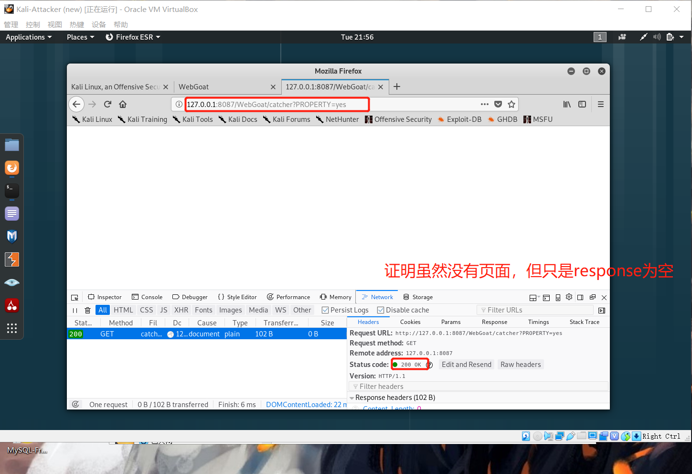
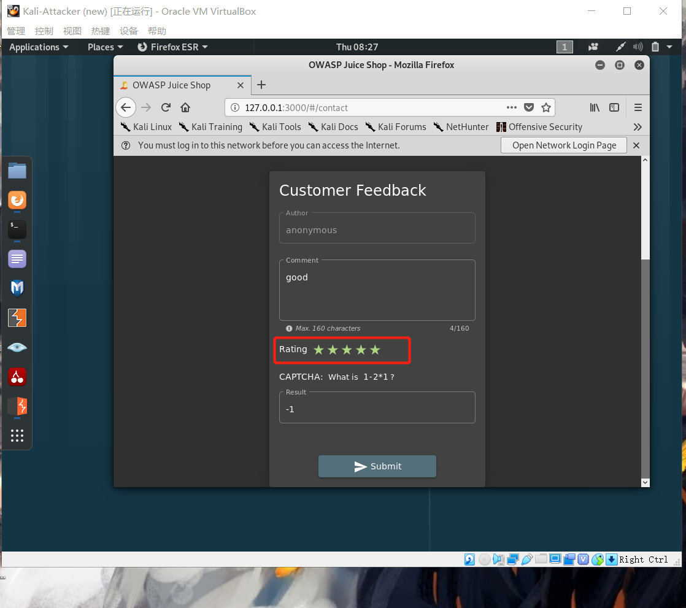
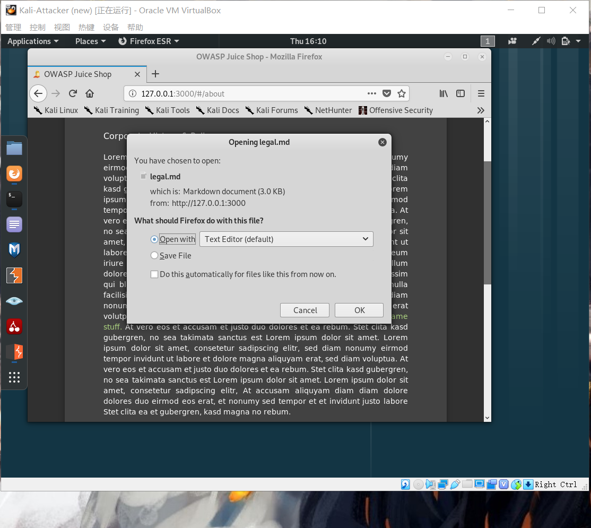
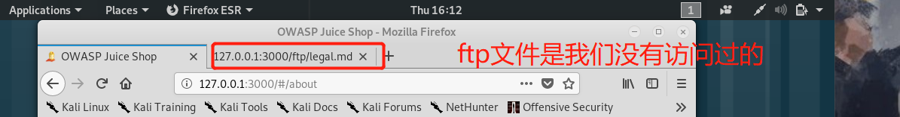

# Web 应用漏洞攻防

## 实验环境

* WebGoat
* Juice Shop
* 虚拟机：Kali-Attacker

## 实验目的

* 了解常见 Web 漏洞训练平台；
* 了解常见 Web 漏洞的基本原理；
* 掌握 OWASP Top 10 及常见 Web 高危漏洞的漏洞检测、漏洞利用和漏洞修复方法；

## 实验完成度

* [x] 搭建WebGoat实验环境
* [x] 搭建Juice Shop实验环境
* [x] 完成WebGoat不少于 5 种不同漏洞类型的漏洞利用练习
* [x] 完成Juice Shop实验环境下不少于 5 种不同漏洞类型的漏洞利用练习

## 实验步骤

* 启动WebGoat实验环境
>使用“启动”这一词是因为这些环境其实已经在docker这个容器中，我们只需用命令启动这个环境
  1. 下载 
  ```bash
  apt update && apt install docker-compose       
 
  # 创建一个文件夹ctf-games,用于存放git clone下来的代码,并进入
  cd /root/docker

  # git clon下载    
  git clone https://github.com/c4pr1c3/ctf-games.git
  
  cd docker/ctf-games/owasp/webgoat/ 
  # update
  docker-compose up -d          
  ```      
  所有的配置都已经升级完成            
                   
    
  2. ```docker ps```               
                    
  3. 修改docker-compse文件：```vi docker-compose.yml```               
  删去所有的```127.0.0.1:```               
                    
                    
  4. 登入WebGoat7版本```127.0.0.1:8087/WebGoat/attack```              
                        
  5. 用WebGoat admin账号进行登录                       
                    
  6. WebGoat7.1版本登陆成功                       
                    

* 启动Juice Shop实验环境
  1. 安装
  ```bash
  cd docker/ctf-games/owasp/juice-shop

  docker-compose up -d
  
  vi docker-compose.yml
  # 删除所有的127.0.0.1：

  docker ps
  ```
  2. ```127.0.0.1:3000```进入Juice Shop               
                  
  3. 发现没有可以做的题目，看注释，需要从源代码找或者自己猜测url               
                    
  4. 提前看过相关攻略，知道有一个积分榜，所以在开发者工具中搜索‘score’,找到了积分榜对应的url:127.0.0.1:3000/#/score-board             
                    
  5. Juice Shop的第一关通过，进入到积分榜，可以开始寻找漏洞了                      
                    

### WebGoat7.1版本

* Parameter Tampering->Bypass HTML Field Restrictions（参数篡改->绕过HTML字段限制）                     
  1. 设置firefox：perferences->(general->network proxy)settings->manual proxy->no proxy for:          
                      
  2. 修改代理                         
                          
  重新进入WebGoat,会发现连接拒绝接入                            
                     
  3. 打开burp suite，再次刷新页面                     
  4. 找到名为“disabledinput”的文本输入             
                    
  5. 禁用的=""参数                  
               
  页面上的disable字段被解锁                           
                    
  6. 打开burp suite,开启断点，拦截请求，会发现六个参数                                    
                     
  7. 修改所有的参数值                     
                    
  8. 点击“forward”或者取消断点，成功                           
                    


* Cross-Site Scripting(XSS)
  1. 设置firefox：perferences->(general->network proxy)settings->manual proxy->no proxy for:          
                    
  2. 修改代理                         
                          
  重新进入WebGoat,会发现连接拒绝接入                            
                     
  3. 打开burp suite，再次刷新页面                     
  4. phishing with XSS
    * 火狐开发者工具->console->console.log(document.cookie)可以查看cookie也就是我们要截获的creditials
    * 访问 http://127.0.0.1:8087/WebGoat/catcher?PROPERTY=yes        
                      
    * 找到漏洞在哪
    提交框里输入```<script>alert(1)</script>```,提交                    
                      
    * 完成任务                      
                      


* Buffer Overflows->Off-by-One Overflows             
  1. 查看java原代码发现对第三个参数长度有限制，如果要发生溢出，长度至少需大于4096           
                    
  2. 随便输入3个参数输入分别为first,last，4321
  3. 进行到选择上网套餐，点击accept，此时进行拦截                    
                    
  4. 将拦截下来的信息复制粘贴到Intruder->position，点击refresh,然后在房间号处添加$$，选择溢出的地方                                          
                    
  5. 修改playload信息                      
                    
                    
  6. 开始攻击            
  7. 得到的结果中发现，长度从5120开始，发生了溢出                  
                    
  8. 将拦截的请求中room_no的值修改为5120个8，forword                       
                        
  9. 查找html页面信息，发现了VIP用户信息                     
                    
  10. 随便填其中一个信息：Johnathan，Ravern，4321                       
  11. 成功                                
                            

* Session Management Flaws->Spoof an Authentication Cookie（欺骗认证Cookie）
  1. 使用webgoat/webgoat登录，然后点击登录，使用代理拦截请求，再点一次forward,获得```Cookie: JSESSIONID=CBC002BE4E5CDBA1BC951E88CF4BC2FF; AuthCookie=65432ubphcfx```            
                            
  也可以在http history中间看到                        
                    
  2. 使用aspect/aspect登录，然后点击“Refresh”，使用代理拦截请求，获取到 Cookie:```Cookie: JSESSIONID=CBC002BE4E5CDBA1BC951E88CF4BC2FF; AuthCookie=65432udfqtb```                
                    
  3. 分析两个AuthCookie，可以发现，其是65432+登录用户名的换位，其换位方式：每个字母都是用户名倒过来，并被替换为它后面的字母                    
  4. 使用alice/alice登录
  5. 代理拦截请求，在Cookie里增加AuthCookie=65432fdjmb               
                      
  6. 成功                      
               

* Injection Flaws->Numeric SQL Injection（数字型SQL注入）
  1. 拦截请求，并将station处的station=101改为station=101 or 1=1            
                    
  2. 发现返回了所有的数据库信息                     
                       
  而在正常的情况下应该只返回101的数据            
                      
  3. 成功                          
                    

### Juice Shop

* Improper Input Validation ->Zero Stars                       
  1. 在Customer Feedback中可以看到有星级打分，但是不能打0颗星。                             
  2. 先打五颗星，提交评论              
                    
  3. 进行代理拦截，然后修改星级的数据，foward                                               
                    
  4. 完成0星评分                                    
                           

* Cross-Site Scripting->DOM XSS
  1. 发现有很多输入框，所以可以尝试 XSS攻击
  2. 往输入框中输入```<iframe src="javascript:alert(`xss`)">```                         
                    
  3. 攻击成功                               
                    

* Injection-> Login Admin    
  1. 要进行sql注入，首先得知道基本的sql语句
  2. 在email处输入```'```,密码随便输，这时候完成了error handing                          
  3. 在email处输入常用的sql语句``` 'or 1=1 - ```
  4. 就可以登陆
                    

* Broken Access Control->View Basket
  1. 登陆多个账号，开启代理拦截，点击“你的购物车”                     
                    
                    
  发现不同账号的购物车，在```GET /rest/basket/6```后面的数字有不同                      
  2. ```GET /rest/basket/6```改为```GET /rest/basket/4```，就跳转到别的购物车里                        
                    

* Sensitive Data Exposure->Confidential Document
  1. 左侧栏中的'about us'中有一个链接，点击可以下载一个.md文件                            
                    
  2. 发现.md文件的链接是：:localhost:3000/ftp/legal.md?md_debug=true，中间有个```ftp```文件夹是没有访问过的，是陌生的                          
  3. 尝试访问```ftp```文件：127.0.0.1:3000/ftp/，发现了很多敏感数据                  
                    
  4. 逐个点击尝试，找到了机密文件                       
                    
  5. 完成Confidential Document                         
                    

## 实验问题
* Cannot connect to the Docker daemon at unix:///var/run/docker.sock. Is the docker daemon running?
service docker start
                    
  解决方法：```service docker start```，重启docker

* 安装Juice Shop:
  ```
  ERROR: for juice-shop-shake-logger  Cannot start service shake-logger: driver failed programming external connectivity on endpoint juice-shop-shake-logger (2ff9Recreating juice-shop    done erland proxy: listen tcp 0.0.0.0:8080: bind: address already in use
  ```
  1. ```vi docker-compose.yml```
  将8080：80改为8070：80

## 实验结论 

* Parameter Tampering->Bypass HTML Field Restrictions（参数篡改->绕过HTML字段限制）                     
  这个漏洞是因为只在html前端进行了限制，也就是只在客户端进行验证和限制，是不安全的，这种验证方式只能帮那些不知道所需输入的用户缩短服务器处理时间，而攻击者攻击者可以用各种方法轻易的绕过这种机制，例如实验中使用代理拦截，能轻松修改从客户端传来的数据。

* Cross-Site Scripting(XSS)
  XSS是因为html在执行的时候对于用户的不安全输入并没有进行一定的检测，而是直接执行，例如输入框中输入了js代码，有些网站时会把```<script></script>```里面的内容注释掉，不执行也不进行显示，而有些网站是只进行显示，安全性最差的就是后台直接运行了js得代码，存储型XSS，反射型XSS，DOM XSS都是没有对用户的输入进行检测，过滤或者解码。
* Buffer Overflows->Off-by-One Overflows             
  缓冲区溢出是指当计算机向缓冲区内填充数据位数时超过了缓冲区本身的容量，溢出的数据覆盖在合法数据上。理想的情况是程序检查数据长度并不允许输入超过缓冲区长度的字符，但是绝大多数程序都会假设数据长度总是与所分配的储存空间相匹配，这就为缓冲区溢出埋下隐患。
  通过向程序的缓冲区写入超出其长度的内容，导致缓冲区的溢出，从而破坏程序的堆栈，造成程序崩溃或使程序转而执行其它指令，以达到攻击的目的。造成缓冲区溢出的原因是程序中没有仔细检查用户输入的参数。缓冲区溢出是一种非常普遍、非常危险的漏洞，在各种操作系统、应用软件中广泛存在。利用缓冲区溢出攻击，可以导致程序运行失败、系统宕机、重新启动等后果。更为严重的是，可以利用它执行非授权指令，甚至可以取得系统特权，进而进行各种非法操作。
  而一般情况下，要知道缓冲区的大小就需要进行多次尝试，例如实验中是用burp进行长度为1024，2024，3024，4024，5024，6024，7024，8024，9024的输入逐一进行缓冲区溢出的尝试，最终发现长度只要大于5024就会返回酒店信息。

* Session Management Flaws->Spoof an Authentication Cookie（欺骗认证Cookie）
  如果验证cookie 正确，一些应用程序会允许一个用户自动登录到他们的网站。有些生成cookie 的算法比较简单，例如例子中间的cookie生成算法就是简单的将用户名逆置，然后取他的后一个字母，在在最前面加上65432。有时候cookie 可能是通过跨站攻击截获的，这种情况是cookie是每次登录的时候都一样。          

* Injection Flaws->Numeric SQL Injection（数字型SQL注入）
  SQL注入即是指web应用程序对用户输入数据的合法性没有判断，攻击者可以在web应用程序中事先定义好的查询语句的结尾上添加额外的SQL语句，例如```'```,```1=1```,```' or 1=1--(注释掉后面的语句)```以此来实现欺骗数据库服务器执行非授权的任意查询。但执行sql攻击的前提是得知道基本的sql查询的格式，当不知道的时候可以通过输入一些非法字符串，如```!@#$%^&*()'"```这些来导致报错，从报错中找到sql查询语句

## 参考资料
* [WebGoat7.1教程](https://www.cnblogs.com/wuweidong/p/8677431.html)
* [OWASP Juice Shop](https://bkimminich.gitbooks.io/pwning-owasp-juice-shop/content/)
* [Juice Shop教程](https://www.cnblogs.com/ichunqiu/p/7778053.html)