# Android环境搭建
## 实验目的
* 了解蜜罐的分类和基本原理
* 了解不同类型蜜罐的适用场合
* 掌握常见蜜罐的搭建和使用
## 实验环境
* 从 paralax/awesome-honeypots 中选择 1 种低交互蜜罐和 1 种中等交互蜜罐进行搭建实验
* ```Kali-Attacker```&```LZQhoneypot```（两个网络配置都是NET网络和host-only）
## 实验完成度
* [x] 记录蜜罐的详细搭建过程；
* [x] 使用 nmap 扫描搭建好的蜜罐并分析扫描结果，同时分析「 nmap 扫描期间」蜜罐上记录得到的信息；
* [x] 如何辨别当前目标是一个「蜜罐」？以自己搭建的蜜罐为例进行说明；
## 实验步骤
### ssh-honeypot蜜罐
* 搭建ssh-honeypot环境
   1. 更改原有ssh服务端口号，将原来的22修改，选择60000以上的端口，不容易被扫描到,```sudo vi /etc/ssh/sshd_config```          
   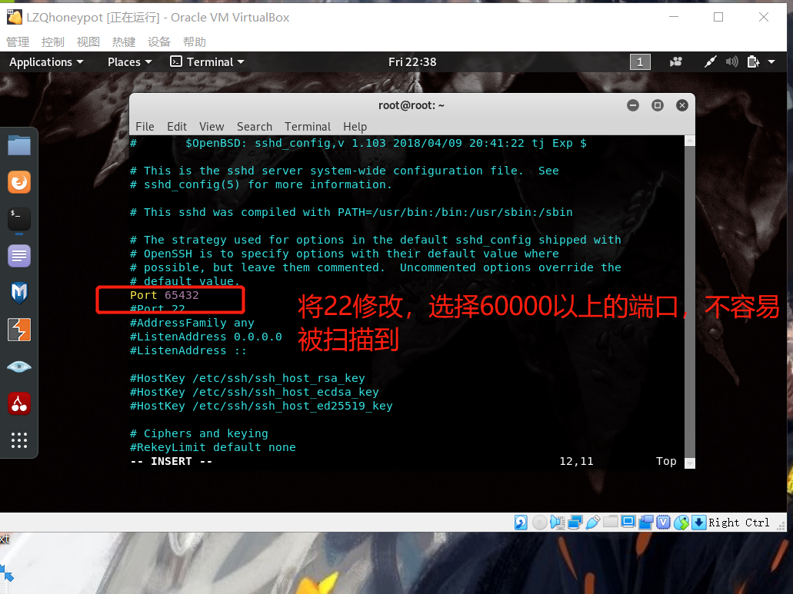                               
   2. 重启ssh服务```sudo service ssh restart```
   3. 确保已安装libssh和libjson-c
   ```bash
   apt-get install
   apt install libssh-dev libjson-c-dev
   ```                 
   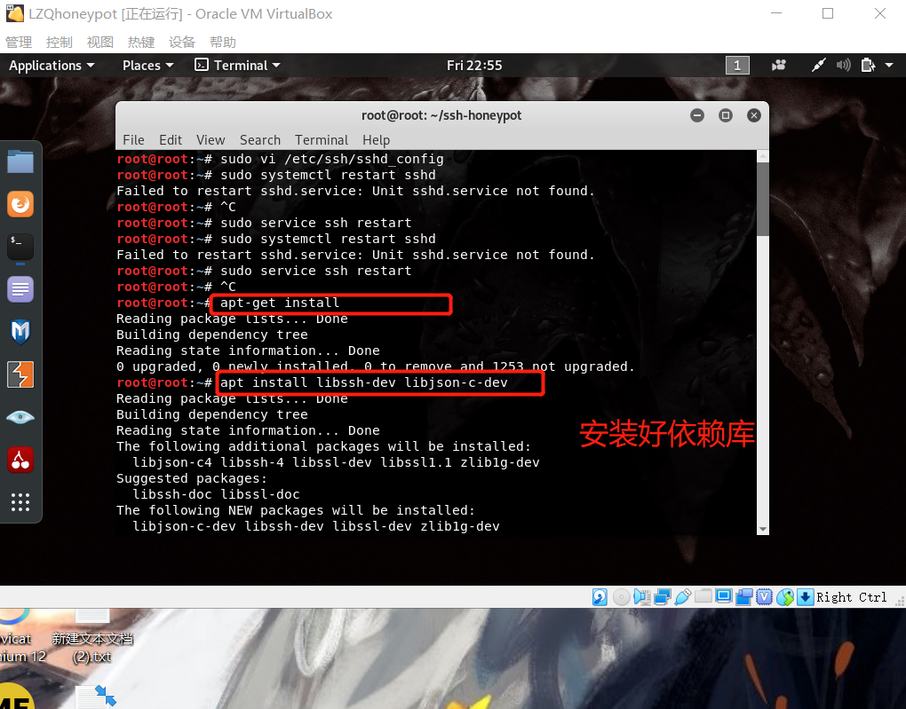                                    
   4. 下载[github ssh-honeypot蜜罐](https://github.com/droberson/ssh-honeypot.git) ```git clone https://github.com/droberson/ssh-honeypot.git```        
   5. 安装运行过程（一直回车）         
   ```bash
   cd ssh-honeypot
   # 安装libssh-dev库
   sudo apt install libssh-dev
   make
   ssh-keygen -t rsa -f ./ssh-honeypot.rsa
   # -l mylog.log选择日志文件，-u cowrie以刚才创建的cowrie身份运行，-d作为守护进程运行
   bin/ssh-honeypot -r ./ssh-honeypot.rsa -p 22 -l mylog.log -f my.pid -u cowrie -d
   ```            
   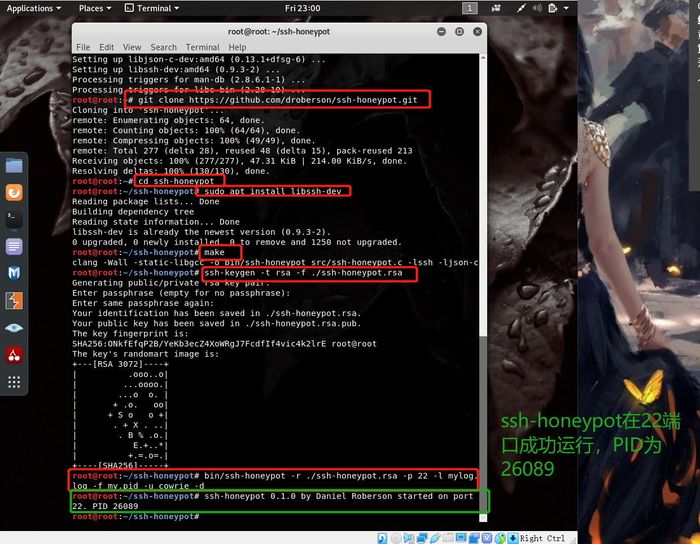                                    

* nmap 扫描ssh-honeypot环境
   >蜜罐的IP地址：10.0.2.6             
   >攻击者的IP地址：10.0.2.15           
   
   1. 查看一下ssh-honeypot的使用文档```bin/ssh-honeypot -h```             
   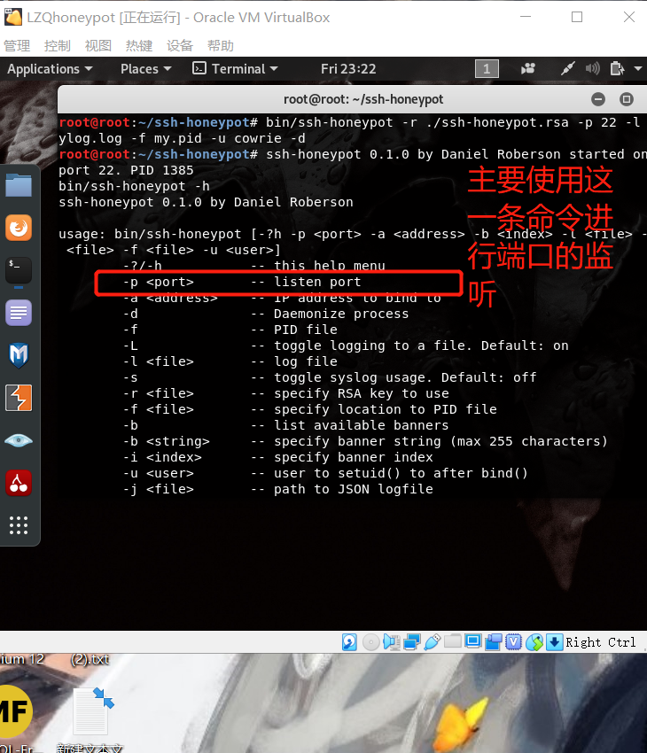                                    
   2. ``victim``开启监听22端口```bin/ssh-honeypot -p 22```
   3. 攻击者通过ssh连接``victim``       
   ```ssh root@10.0.2.6 -p 22```
   4. ``victim``这边会记录下攻击者的真实IP，每次尝试连接时的时间，使用的用户名和密码。而对于攻击者来说，无论输入的密码是否正确都会显示被拒绝连接。因为ssh-honeypot是一种低交互蜜罐，该程序侦听传入的ssh连接，并记录所使用的IP地址，用户名和密码。这是为了收集有关暴力攻击的基本情报。               
   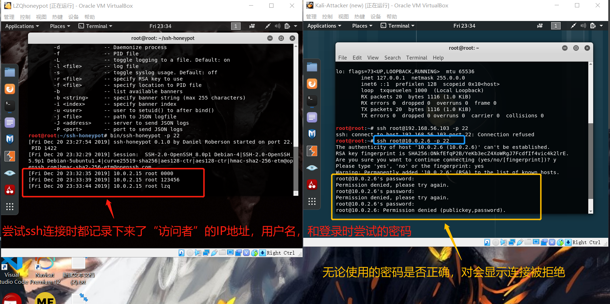                               
   同时这些记录也都会记录在/bin/ssh-honeypot.log中
   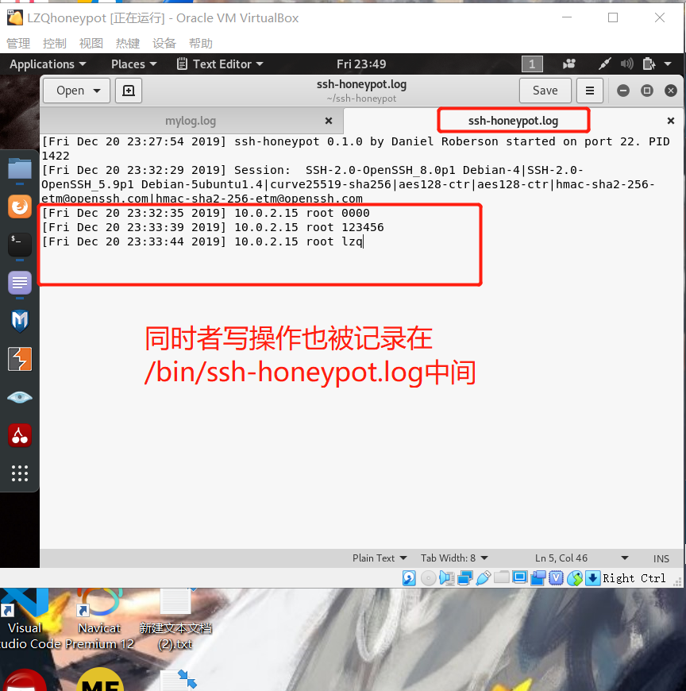                                    
   5. 使用```nmap -p 22 10.0.2.6```进行nmap扫描会发现，攻击者能够扫描到```victim```的22号端口是开放的，并且上面的服务是ssh。但是同时可以发现```victim```这边，22号端口的监听和ssh-honeypot.log都没有记录下来```attacker```的nmap扫描的行为。
   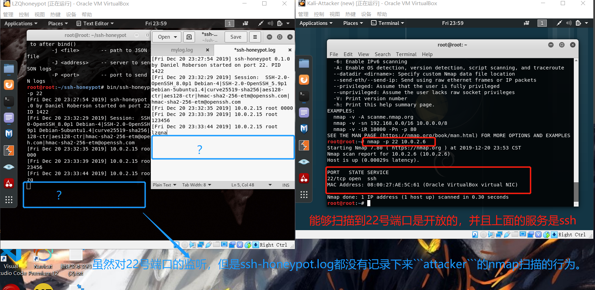                                    


### cowrie蜜罐
> 在不使用docker的情况下安装cowrie失败了，所以考虑在docker下安装cowrie蜜罐环境
* docker安装
   1. Docker需要Linux Kernels 大于3.10并且是64-bit的机器，用```uname -a```可以查看是否符合要求。        
   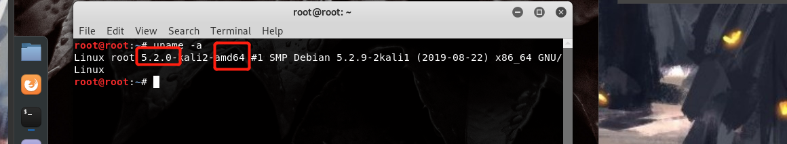                           
   2. 安装docker
   ```bash
   apt-get update
   apt-get install docker docker-compose
   ```
   3. 启动```service docker start```
*  cowrie蜜罐环境搭建
   1. 下载镜像 ```docker pull cowrie/cowrie``` 因为是直接下载的docker，并没有配置镜像，所以在这一步下载的时候会非常的慢(后来发现是网的问题)                         
   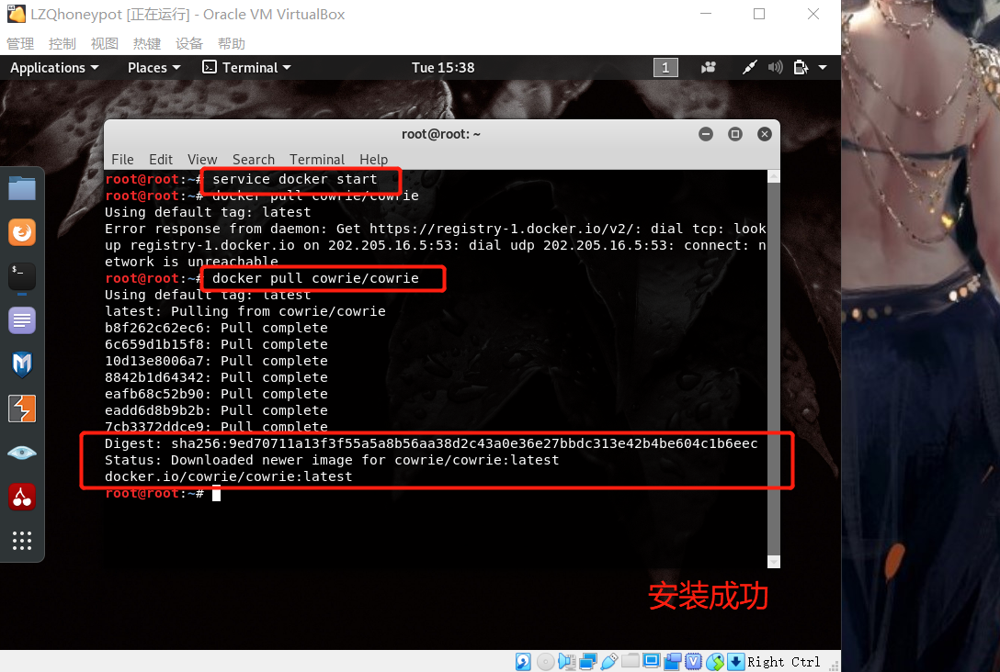                                   
   2. 启用cowrie蜜罐```docker run -p 2222:2222 cowrie/cowrie```         
   3. 另外开一个命令行```docker ps```可以看到cowrie是在2222和2223端口进行监听                     
   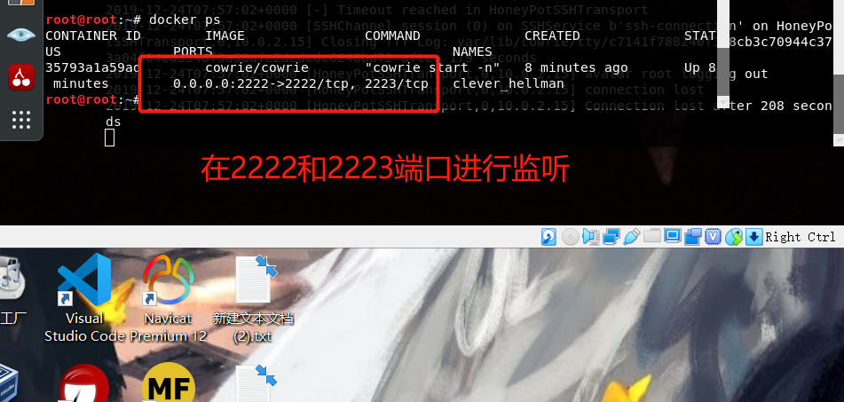                                    
* nmap 扫描ssh-honeypot环境
   >蜜罐的IP地址：10.0.2.6             
   >攻击者的IP地址：10.0.2.15          
   1. 攻击者通过ssh连接``victim``，```ssh root@10.0.2.6 -p 22```，会发现在执行```docker run```指令的那个窗口下面的输出也记录下来你的操作，但是内容没有日志那么详细。
   2. 登陆后，会发现```victim```记录下来了登陆的IP，用户名和密码                
   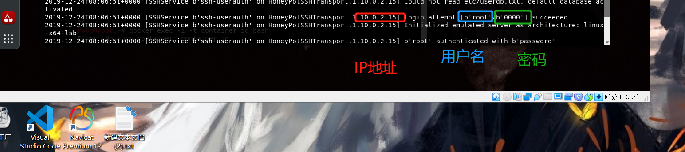                                    
   3. ```attacker```执行```id```发现自己获得是root权限。```cat /etc/passwd```查看密码，发现所有的命令都被日志所记录下来，而且这些命令查看的结果与真实主机并没有什么不同                
   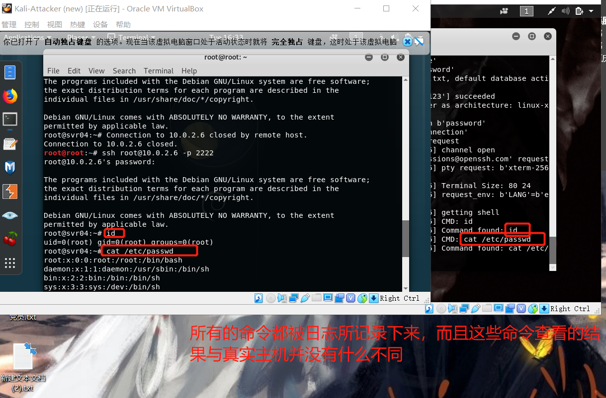                                    
   4. ```nmap -sV 10.0.2.6```扫描所有端口，会发现只有两个端口是有应用在这上面监听的                               
   同时在```victim```这一端会发现，```attacker```的扫描行为是被记录下来了，源IP地址和端口，目标IP地址和端口都被记录。但是dst_ip是172.17.0.2，是一个静态地址，不像是常用的IP地址                    
   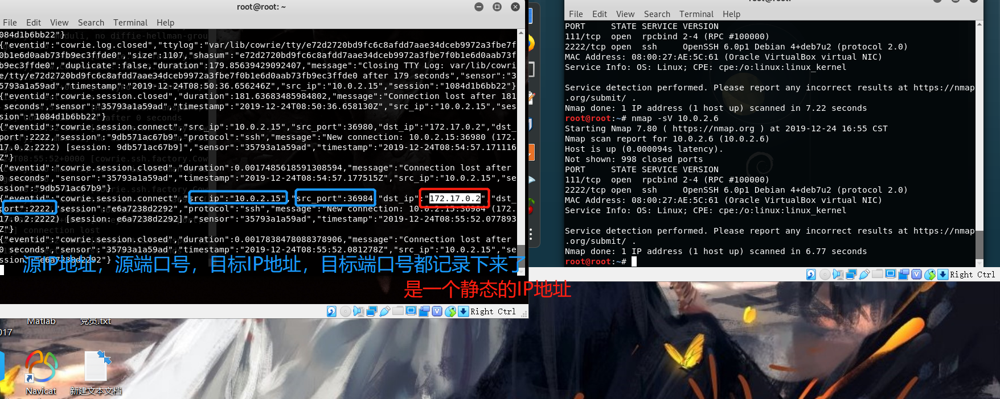                                    
   5. ```nmap -p 2222 10.0.2.6```扫描固定端口2222,发现上面扫描出来的服务是EtherNetIP-1，不是```nmap -sV 10.0.2.6```扫描出来的ssh，而且```victim```的日志中并没有记录       
   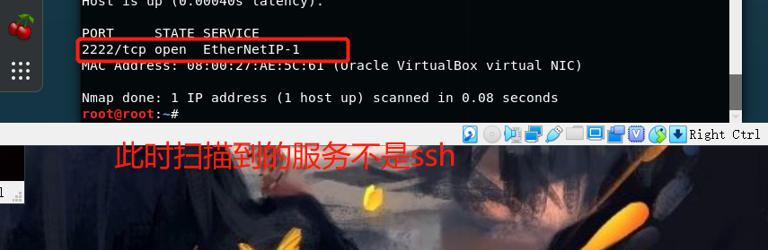                                    

## 实验结论
* 如何辨别当前目标是一个「蜜罐」
   1. 扫描整个主机的端口，会发现有些蜜罐的几乎所有的端口都是关闭的，常用的应用的没有对某个端口进行监听。例如对ssh-honeypot蜜罐进行扫描```nmap -sV 10.0.2.6```，会发现998个端口都是处于关闭状态，之开启了两个端口。
   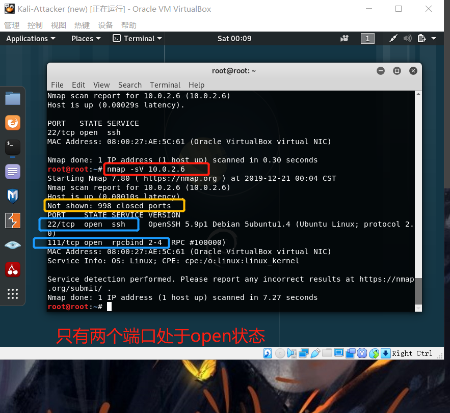                               
   2. 对于像ssh-honeypot蜜罐这样低交互蜜罐，当你进行多次ssh破解或者说你用正确的密码都显示连接不上，就很显然你进入到了一个蜜罐环境。但是像cowrie这样中交互蜜罐，会发现与ssh-honeypot蜜罐这样低交互蜜罐相反，因为别人期待你进入蜜罐里面去，所以你随便用什么密码都是能进去的。      
   3. ssh连接是有时间限制的。在查看老师代码的一小段时间里，就会发现ssh连接自动断开了。但是在以往用ssh连接其他机器的时候会发现ssh连接其实是非常稳定的，反正在完成实验的这一段时间里都是处于一个稳定状态。                  
   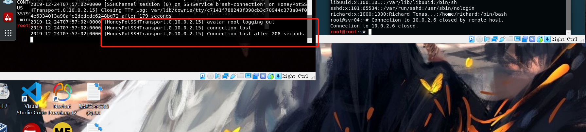                              
   5. 扫描时后所用到的包，仔细观察会发现dst_ip是一个静态地址，而不是我们所常见的IP地址               
   4. 对于cowrie蜜罐来说```nmap -sV 10.0.2.6```和```nmap -p 2222 10.0.2.6```两种扫描的显示2222端口的服务是不同.而在没有开启蜜罐的环境下，两种扫描结果是一样的                          
   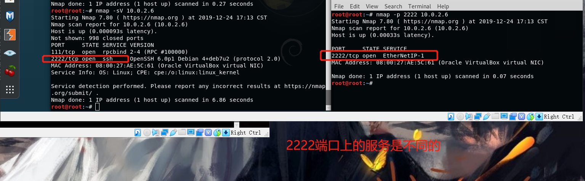                                   
   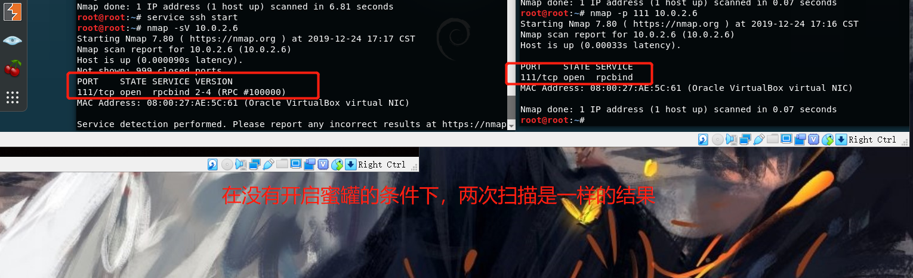                                  


## 实验问题
### cowrie蜜罐搭建失败案例
* cowrie安装部署
    
   1. 创建一个非系统用户（普通用户）```adduser cowrie```(密码：0000)           
   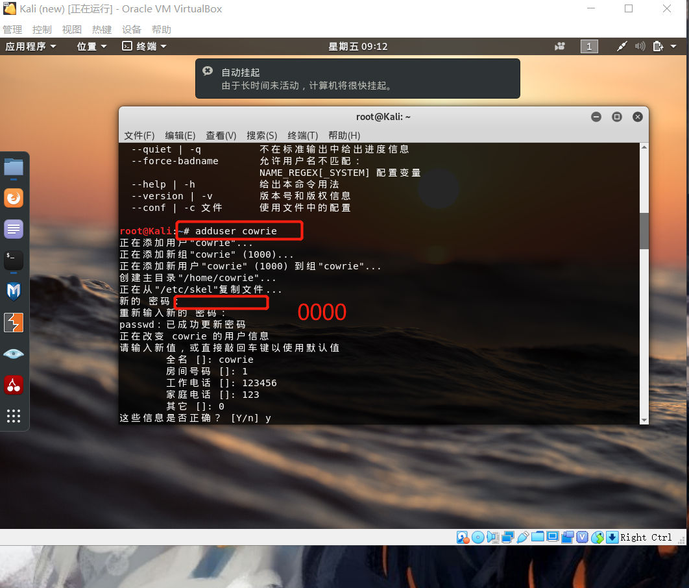                                  
   2. 安装各种python相关包    
   ```bash   
   apt-get update
   apt-get install -y python-twisted python-crypto python-pyasn1 python-gmpy2 python-mysqldb python-zope.interface
   ```                     
   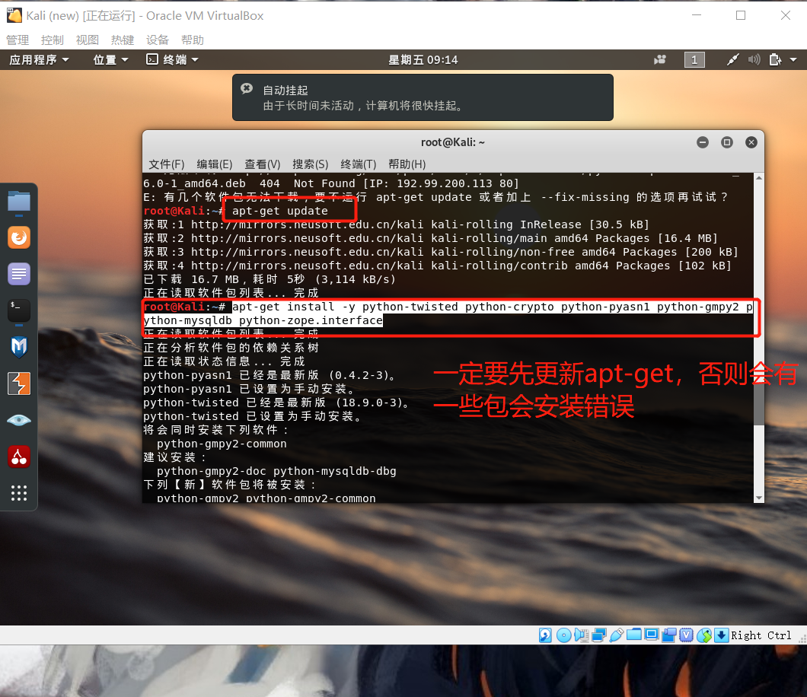                             
   3. 安装virtualenv ```apt-get install virtualenv```             
   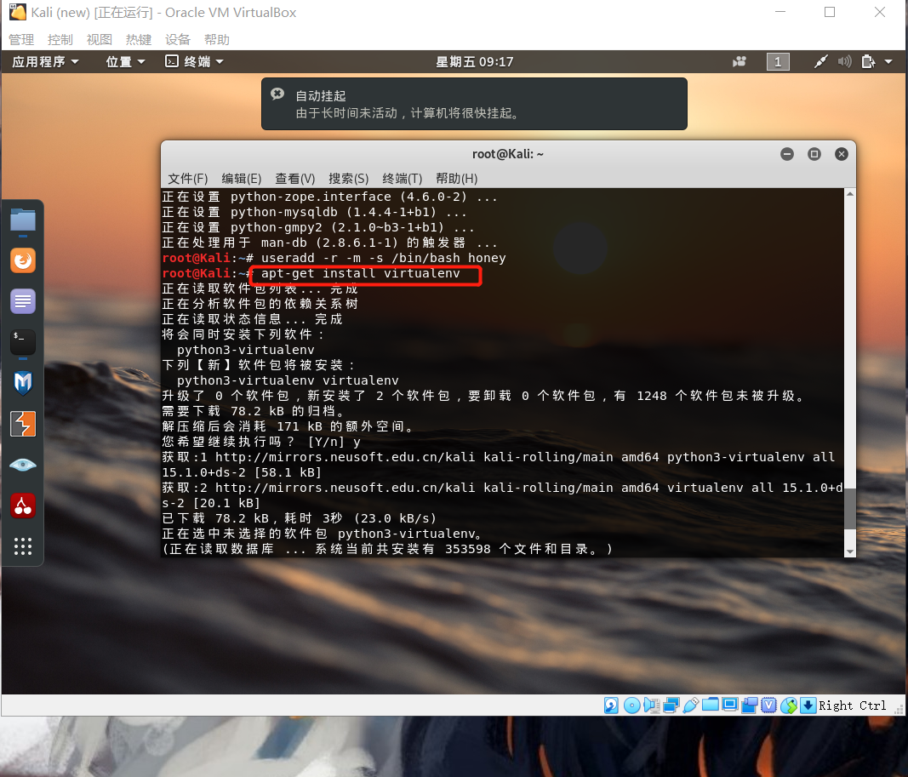                                 
   4. 下载cowire    
   ```bash
   cd /opt
   git clone http://github.com/micheloosterhof/cowrie
   ```
   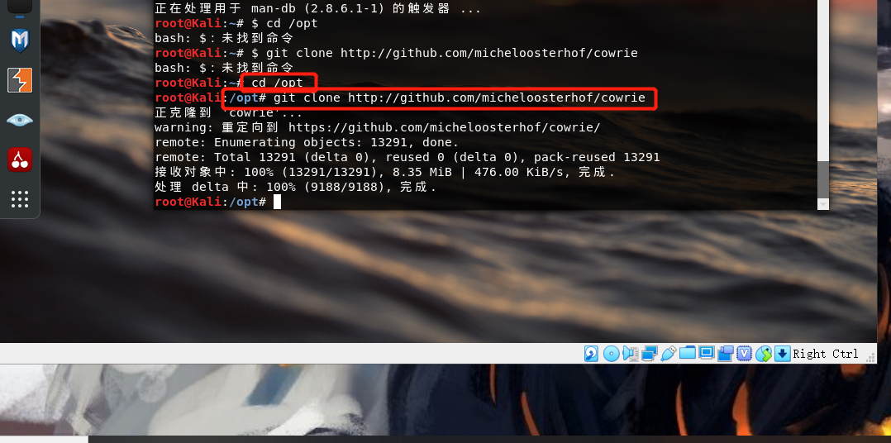                                    
   5. 配置python虚拟环境
   ```bash
   cd /opt/cowrie
   virtualenv env
   source env/bin/activate
   pip3 install twisted cryptography pyopenssl gmpy2
   ```        

   6. 改变/opt/cowrie的拥有者```chown -R honey:honey /opt/cowrie```
   7. 建立 cowrie配置文件```cp /opt/cowrie/etc/cowrie.cfg.dist cowrie.cfg```                                         
   8. 将公网访问服务器22端口的请求做端口转发，转发到蜜罐的端口中```iptables -t nat -A PREROUTING -p tcp --dport 22 -j REDIRECT --to-port 63333```
   9. 将真正的（非蜜罐）SSH管理端口改为65522```vi /etc/ssh/sshd_config```    
    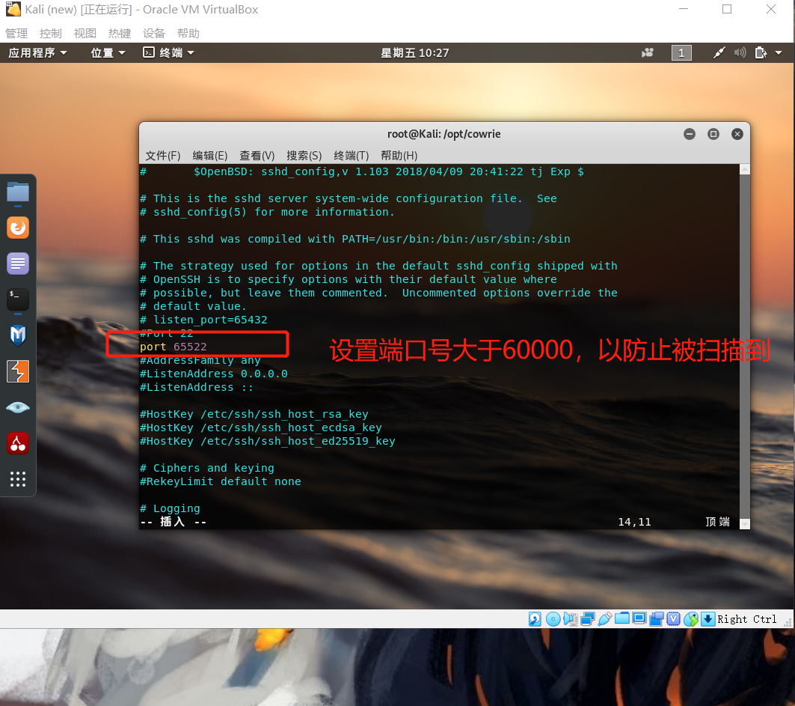                                    
   10. start.sh开启，但是下载文件中手动自动遍历了所有文件都没有这个文件         
    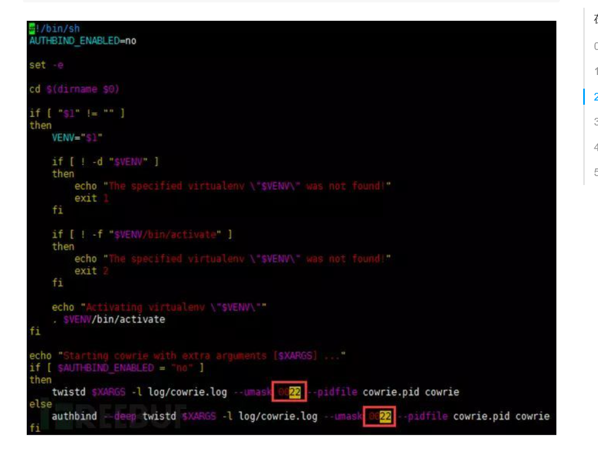                                      
   **在重新下载四次后放弃这种方式搭建**

*  ```pip3 install twisted cryptography pyopenssl gmpy2```安装出错            
   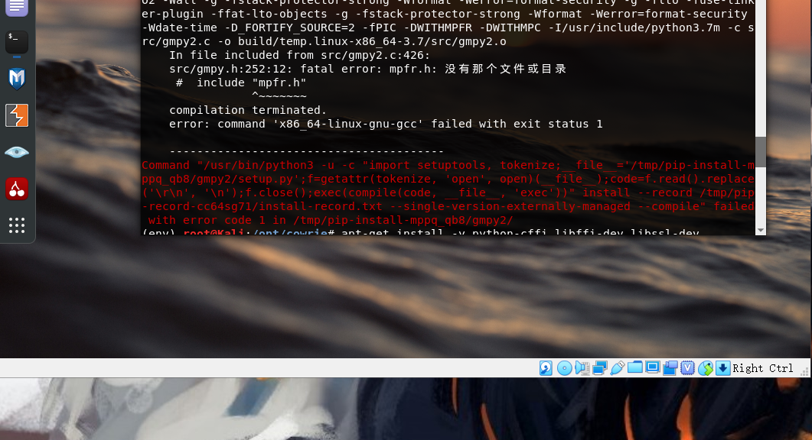                             
   * 需要下载一些依赖项
   ```bash
   apt-get install -y python-cffi libffi-dev libssl-dev
   apt-get install -y libgmp-dev libmpfr-dev libmpc-dev
   ```
   再次执行成功              
   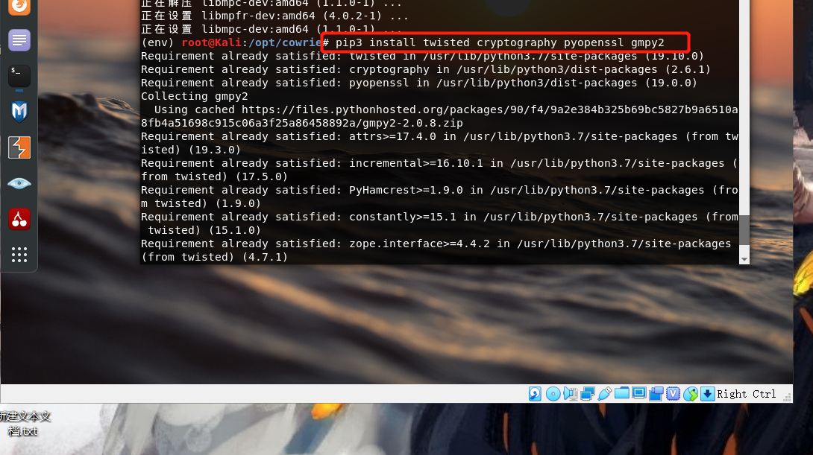                                    

* 找不到cowrie.cfg.dist文件
   * 开始怀疑文件没有下载完全，后来发现cowrie.cfg.dist的目录与参考资料的目录不一样，在/opt/cowrie/etc下面   

* docker:找不到命令
   * ```apt-get install  docker```

### 重新搭建过程中的问题
* 查看日志失败```docker exec -it cowrie_cowrie_l tail -F /cowrie/cowrie-git/var/log/cowrie/cowrie.json```
  1. ```docker -h```发现```docker exec```命令的作用是```Run a command in a running container```                
  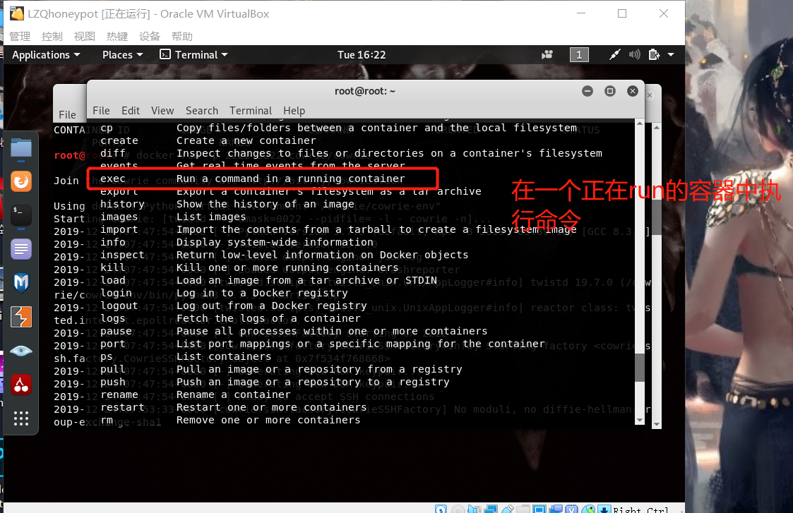                                    
  2. ```it```这个后面应该跟着自己的容器名         
  3. ```docker ps```查看自己的容器名为clever_hellman                 
  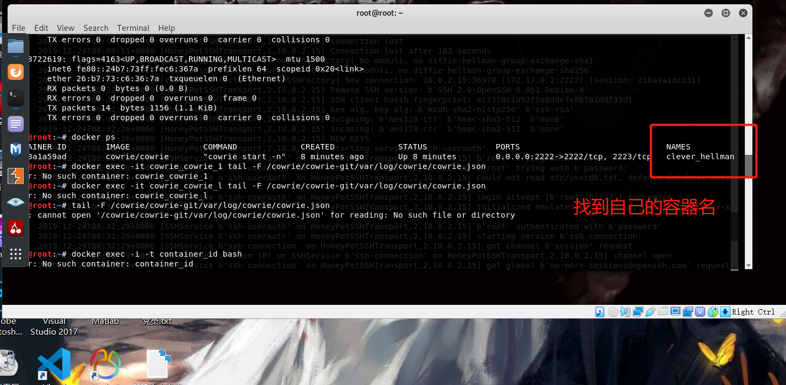                                    
  4. ```docker exec -it clever_hellman tail -F /cowrie/cowrie-git/var/log/cowrie/cowrie.json```成功查看日志          
  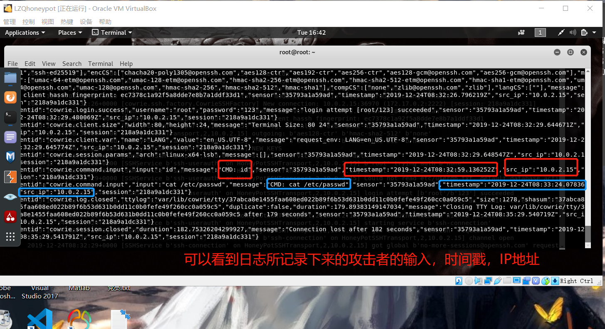                                    


## 参考资料
* [ paralax/awesome-honeypots](https://github.com/paralax/awesome-honeypots)
* [蜜罐](https://www.helplib.com/GitHub/article_125662)
* [cowrie安装部署（缺少文件）](https://blog.csdn.net/youjianzhou/article/details/55505243)
* [github ssh-honeypot蜜罐](https://github.com/droberson/ssh-honeypot)
* [ssh-honeypot蜜罐搭建参考](https://blog.csdn.net/star92014/article/details/89260094)
* [docker安装](https://www.cnblogs.com/dnoir/p/11043967.html)
 